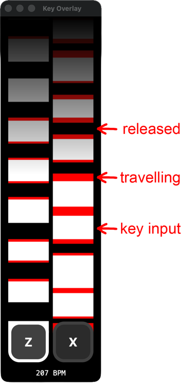
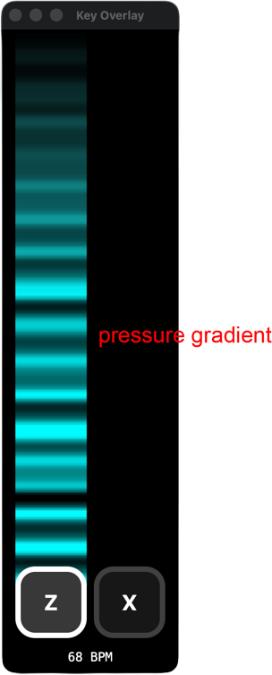

# Better Key Overlay

[](https://github.com/Kaillr/better-key-overlay/releases/latest)
[](https://github.com/Kaillr/better-key-overlay/releases/latest)
[]()

A customizable key overlay with analog pressure visualization.





## Features

- Scrolling pressure visualization with customizable colors and speed
- Pressure-reactive key buttons
- KPS & BPM counter
- Works with any keyboard - full analog support for Wooting and DrunkDeer devices
- Fully customizable through the settings window

## Download

Grab the latest version from the [releases page](https://github.com/Kaillr/better-key-overlay/releases/latest).

| Platform | What to download |
|----------|-----------------|
| Windows | `...-setup.exe` to install, or the other `.exe` to run without installing |
| macOS | `.dmg` |
| Linux | `.AppImage` or `.deb` |

### macOS Note

The macOS build is not code-signed. After installing, run:

```
xattr -cr /Applications/Better\ Key\ Overlay.app
```

## Usage

1. **Add keys** — Right-click the overlay to open settings, click "Add Key" and press the key you want to track
2. **Customize** — Adjust colors, key styles, scroll speed, fade effect, and more in settings
3. **Stream** — Use OBS window capture to add the overlay. Set the blend mode to **Add** to remove the black background

## Verified Analog Devices

- **Wooting** — All models (60HE, 80HE, Two HE, UWU, etc.)
- **DrunkDeer** — All rapid trigger models
